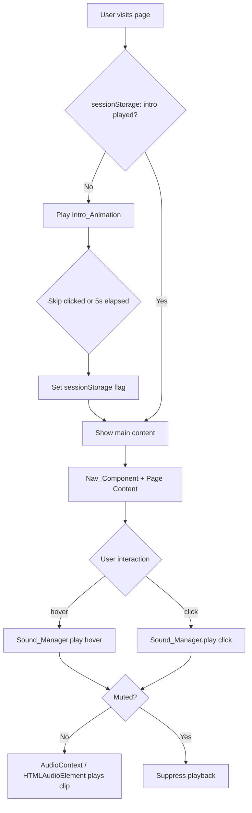

# Design Document

## Overview

The Persona 3 Reload Website is a static multi-page site built with HTML5, CSS3, and vanilla JavaScript. It faithfully replicates the visual and interactive identity of the Persona 3 Reload in-game pause menu: dark navy geometry, glowing cyan accents, angular panel decorations, and responsive UI sounds. The architecture is intentionally framework-free — every feature is implemented using native browser APIs to meet the performance and simplicity requirements.

The site is composed of four minimum required pages (Home, About, Gallery, Contact) plus a styled 404 page, a shared navigation component, a one-time entrance animation gated by `sessionStorage`, and a centralized `SoundManager` module for hover and click audio feedback. A persistent mute toggle backed by `localStorage` controls global audio state across sessions.

---

## Architecture

The project follows a **flat file structure** with shared assets and a single JavaScript module for sound management. Each page is a self-contained HTML file that links a shared stylesheet and the `SoundManager` module.

```
/
├── index.html             # Home page
├── about.html             # About page
├── gallery.html           # Gallery / Portfolio page
├── contact.html           # Contact page
├── 404.html               # Styled 404 error page
├── css/
│   ├── theme.css          # Global Pause Menu Theme styles (colors, fonts, geometry)
│   ├── nav.css            # Nav_Component styles
│   ├── intro.css          # Intro_Animation styles and keyframes
│   └── pages/
│       ├── home.css
│       ├── about.css
│       ├── gallery.css
│       └── contact.css
├── js/
│   ├── sound-manager.js   # Sound_Manager module (singleton)
│   ├── intro.js           # Intro_Animation controller
│   └── nav.js             # Nav_Component active-state logic
├── assets/
│   ├── audio/
│   │   ├── hover.mp3      # Hover_Sound (≤500ms)
│   │   └── click.mp3      # Click_Sound (≤500ms)
│   └── images/
│       └── ...            # Decorative images with alt text
└── fonts/
    └── ...                # Self-hosted web fonts (Rajdhani / Orbitron)
```



---

## Components and Interfaces

### 1. Pause Menu Theme (CSS)

`theme.css` defines the global design tokens and reusable component styles that express the Pause_Menu_Theme.

**Design tokens:**
```css
:root {
  --color-bg:          #0a0e1a;
  --color-accent:      #00d4ff;   /* cyan highlight */
  --color-text:        #e8f0ff;   /* near-white */
  --color-panel-border:#1a2a4a;
  --color-active:      #00d4ff;
  --font-heading:      'Rajdhani', 'Orbitron', sans-serif;
  --font-body:         'Rajdhani', sans-serif;
  --transition-fast:   120ms ease;
}
```

**Geometric decorations** are implemented with CSS `clip-path` (trapezoid/diagonal cut) and `::before`/`::after` pseudo-elements to avoid extra markup. At least one decorative motif per page (e.g., the circular clock on Home, diagonal stripe dividers on Gallery).

**Hover highlight:** nav items use a `box-shadow` + `background` transition on `:hover` and `.active` classes. The glow effect uses `box-shadow: 0 0 8px var(--color-accent)`.

**Reduced motion:** all `@keyframes` and `transition` declarations in `theme.css` and `intro.css` are wrapped in a `@media (prefers-reduced-motion: no-preference)` block. The default (when motion is reduced) is a near-instant state change with no animation.

### 2. Nav Component

`nav.js` runs on every page. On `DOMContentLoaded` it:
1. Reads `window.location.pathname` to determine the active page.
2. Finds the corresponding `<a>` element in the `<nav>` and adds the `.active` class to it.
3. Attaches `mouseenter` event listeners to all `<a>` and `<button>` elements in the nav for hover sound triggering.
4. Attaches `click` event listeners (with `event.preventDefault()` followed by a short delay before `location.href` assignment) to play the click sound before navigating.

**HTML structure (shared partial, inlined in each page):**
```html
<nav class="p3-nav" aria-label="Main navigation">
  <ul role="list">
    <li><a href="/index.html" data-page="home">Home</a></li>
    <li><a href="/about.html" data-page="about">About</a></li>
    <li><a href="/gallery.html" data-page="gallery">Gallery</a></li>
    <li><a href="/contact.html" data-page="contact">Contact</a></li>
  </ul>
  <button class="mute-toggle" id="muteToggle" aria-label="Toggle sound" aria-pressed="false">
    🔊
  </button>
</nav>
```

### 3. Sound Manager

`sound-manager.js` exports a singleton `SoundManager` object.

**Interface:**
```js
const SoundManager = {
  /** Load and cache all audio assets. Call once on page load. */
  init()  { ... },

  /**
   * Play a registered sound by name.
   * @param {string} soundName - 'hover' | 'click'
   */
  play(soundName) { ... },

  /** Mute all audio and persist preference to localStorage. */
  mute()   { ... },

  /** Unmute all audio and persist preference to localStorage. */
  unmute() { ... },

  /** Returns true if currently muted. */
  get isMuted() { ... }
};
```

**Implementation notes:**

- A single `AudioContext` instance is created lazily on the first user interaction (to comply with browser autoplay policies — Requirement 4.5).
- Audio files are fetched with the Fetch API and decoded into `AudioBuffer` objects, then stored in an internal `Map<string, AudioBuffer>`.
- `play(soundName)` creates a new `AudioBufferSourceNode` each call (source nodes are single-use in Web Audio API), connects it to `AudioContext.destination`, and calls `.start(0)`.
- If `AudioContext` is not available (`typeof AudioContext === 'undefined'`), the fallback path clones an `HTMLAudioElement` for each play call.
- `mute()` / `unmute()` set an internal `_muted` boolean and write `localStorage.setItem('p3-muted', _muted ? '1' : '0')`.
- On `init()`, the stored `localStorage` preference is read and applied.
- The mute toggle button in the nav is updated via `aria-pressed` and an icon swap (`🔊` / `🔇`) whenever `mute()` / `unmute()` are called.

**Autoplay deferral:**
```js
let _contextReady = false;
const _pendingPlays = [];

document.addEventListener('click', _unlockAudio, { once: true });
document.addEventListener('keydown', _unlockAudio, { once: true });

function _unlockAudio() {
  _context = new AudioContext();
  _contextReady = true;
  _pendingPlays.forEach(name => _playSoundNow(name));
  _pendingPlays.length = 0;
}
```

### 4. Intro Animation

`intro.js` runs only on `index.html` (or can be included on all pages; it checks `sessionStorage` and exits immediately if the flag is set).

**Sequence:**
1. On `DOMContentLoaded`, read `sessionStorage.getItem('p3-intro-played')`.
2. If flag is set → remove the intro overlay from the DOM immediately and show main content.
3. If flag is not set → display the `#intro-overlay` element (full-screen, `position: fixed`, z-index 9999).
4. Start CSS `@keyframes` animations: title logo fades/slides in over ~1.5s, then a hold for ~1s, then the overlay fades out over ~1s (total ≤ 5s).
5. After the fade-out `animationend` event fires (or after a 5000ms `setTimeout` fallback), call `_endIntro()`.
6. Skip button (`#intro-skip`) calls `_endIntro()` immediately on click, Space, or Enter.
7. `_endIntro()` sets `sessionStorage.setItem('p3-intro-played', '1')`, removes the overlay, and restores `document.body` scroll.

**HTML structure (in index.html `<body>`):**
```html
<div id="intro-overlay" role="dialog" aria-modal="true" aria-label="Intro animation">
  <div class="intro-logo">PERSONA 3 RELOAD</div>
  <button id="intro-skip" tabindex="0" aria-label="Skip intro">PRESS ANY KEY / CLICK TO SKIP</button>
</div>
```

### 5. Pages

Each page consists of:
- A `<header>` with the site title.
- The shared `<nav>` markup.
- A `<main>` section with page-specific content.
- A `<footer>` with copyright.

| Page | File | Key Content |
|------|------|-------------|
| Home | `index.html` | Hero section with circular clock motif, intro animation hook |
| About | `about.html` | Bio/project description with angular panel layout |
| Gallery | `gallery.html` | Image grid with diagonal stripe dividers |
| Contact | `contact.html` | Contact form styled as a P3 menu |
| 404 | `404.html` | Error message in Pause_Menu_Theme, link back to Home |

---

## Data Models

### SessionStorage Schema

| Key | Value | Set When |
|-----|-------|----------|
| `p3-intro-played` | `"1"` | Intro animation completes or skip is pressed |

### LocalStorage Schema

| Key | Value | Set When |
|-----|-------|----------|
| `p3-muted` | `"1"` or `"0"` | User calls `mute()` or `unmute()` |

### SoundManager Internal State

```js
{
  _context: AudioContext | null,
  _buffers: Map<string, AudioBuffer>,   // 'hover' → AudioBuffer, 'click' → AudioBuffer
  _muted: boolean,
  _contextReady: boolean,
  _pendingPlays: string[]               // sound names queued before AudioContext unlocked
}
```

### Audio Asset Manifest

| ID | File | Max Duration |
|----|------|-------------|
| `hover` | `assets/audio/hover.mp3` | 500ms |
| `click` | `assets/audio/click.mp3` | 500ms |

---

## Correctness Properties

*A property is a characteristic or behavior that should hold true across all valid executions of a system — essentially, a formal statement about what the system should do. Properties serve as the bridge between human-readable specifications and machine-verifiable correctness guarantees.*

The SoundManager and Intro logic are pure in-memory modules that are well-suited to property-based testing. UI/CSS styling requirements are verified through example-based DOM assertions rather than properties. The following properties cover the testable behavioral invariants.

---

### Property 1: Nav hover triggers visual highlight and sound

*For any* element within the Nav_Component that has a registered hover listener, triggering a `mouseenter` event on that element should result in: (a) the highlight CSS class being applied to that element, and (b) `SoundManager.play('hover')` being called exactly once.

**Validates: Requirements 1.7, 4.1**

---

### Property 2: Nav component present and structurally valid on every page

*For any* page in the Website, the rendered DOM should contain a `<nav>` element with at least four `<a>` child elements pointing to the Home, About, Gallery, and Contact pages.

**Validates: Requirements 2.2, 2.5**

---

### Property 3: Active page is highlighted in the nav

*For any* page in the Website, exactly one nav `<a>` element should carry the `.active` CSS class, and it should correspond to the `href` matching the current page.

**Validates: Requirements 2.4**

---

### Property 4: Nav link hrefs are correct

*For any* nav link element, its `href` attribute should resolve to a page that exists in the file system (i.e., no broken internal links).

**Validates: Requirements 2.3**

---

### Property 5: Intro shows on first visit and is skipped on repeat (round-trip)

*For any* clean browser session (sessionStorage cleared), loading `index.html` should display the intro overlay. After the intro completes or is skipped, reloading `index.html` in the same session should skip the overlay entirely.

**Validates: Requirements 3.1, 3.2**

---

### Property 6: Intro completion and skip both set the sessionStorage flag

*For any* method of ending the intro (timer expiry or skip button press), `sessionStorage.getItem('p3-intro-played')` should equal `"1"` afterwards.

**Validates: Requirements 3.3, 3.7**

---

### Property 7: Click sound plays before navigation

*For any* navigation link or interactive button, simulating a `click` event should result in `SoundManager.play('click')` being called before `window.location` changes.

**Validates: Requirements 5.1**

---

### Property 8: Hover sound resets on rapid successive hovers

*For any* state where the hover sound is currently playing, triggering a new `mouseenter` event should cause the SoundManager to stop the current play and restart the hover sound from the beginning.

**Validates: Requirements 4.4**

---

### Property 9: Muted state suppresses all sound playback

*For any* sound name (`'hover'` or `'click'`), calling `SoundManager.play(soundName)` while `SoundManager.isMuted` is `true` should not invoke any AudioContext playback method.

**Validates: Requirements 6.4**

---

### Property 10: Mute preference round-trips through localStorage

*For any* toggle sequence (mute → unmute or unmute → mute), the final state should be accurately reflected in `localStorage.getItem('p3-muted')` and restored correctly when `SoundManager.init()` is called again.

**Validates: Requirements 6.5**

---

### Property 11: Mute toggle control present on every page

*For any* page in the Website, the DOM should contain exactly one element matching the `#muteToggle` selector with a valid `aria-label`.

**Validates: Requirements 6.6**

---

### Property 12: Accessibility invariants hold for every page

*For any* page in the Website:
- All `` elements have a non-empty `alt` attribute.
- All interactive elements (`<a>`, `<button>`, `<input>`, `<textarea>`) have a `tabindex` value ≥ 0 and a CSS `:focus` style that visually differs from the default.
- The page contains at least one `<header>`, `<nav>`, `<main>`, and `<footer>` element.

**Validates: Requirements 7.2, 7.3, 7.4**

---

### Property 13: Reduced motion respected for all animated elements

*For any* CSS rule that defines a `transition` or `animation`, an equivalent rule inside a `@media (prefers-reduced-motion: reduce)` block should override it with `animation: none` or `transition: none` (or equivalent near-instant values).

**Validates: Requirements 7.5**

---

## Error Handling

| Scenario | Handling |
|----------|----------|
| Audio file fails to load | `SoundManager.init()` catches the fetch/decode error; the sound is silently skipped (no crash). Subsequent `play()` calls for that sound are no-ops. |
| `AudioContext` not supported | SoundManager detects `typeof AudioContext === 'undefined'` and uses `HTMLAudioElement` clone per play call instead. |
| Browser blocks autoplay | AudioContext creation is deferred to first user interaction; pending play calls are queued. |
| Navigation to non-existent page | A `404.html` file is served (requires server-side configuration or GitHub Pages fallback). The page renders with Pause_Menu_Theme styling and a Home link. |
| `sessionStorage` unavailable | `intro.js` wraps sessionStorage access in `try/catch`; if unavailable, the intro plays every visit (graceful degradation). |
| `localStorage` unavailable | `SoundManager.mute()`/`unmute()` catch the error and operate in-memory only; preference is not persisted. |
| CSS font load failure | System sans-serif fallback is declared in `--font-heading`; layout remains functional. |

---

## Testing Strategy

### Approach

Given this is a vanilla HTML/CSS/JS static site, the testing strategy uses:

1. **Unit tests** (Jest + jsdom): Test the SoundManager module and intro.js logic in a simulated DOM environment.
2. **Property-based tests** (fast-check): Verify universal behavioral invariants of the SoundManager and session/nav logic across randomized inputs.
3. **DOM integration tests** (Jest + jsdom or Playwright): Verify per-page structural requirements (nav presence, semantic elements, accessibility attributes).
4. **Visual/snapshot tests**: Manual review or screenshot comparison for Pause_Menu_Theme fidelity.
5. **Lighthouse CI**: Automated performance score check against the Home page in CI.

### Property-Based Testing Library

**fast-check** (npm: `fast-check`) is used for all property-based tests. Each property test runs a minimum of **100 iterations**.

Each property test is tagged with a comment in the format:
```
// Feature: persona3-reload-website, Property N: <property text>
```

### Test Configuration

```js
// jest.config.js
module.exports = {
  testEnvironment: 'jsdom',
  setupFiles: ['./tests/setup.js']
};
```

### Testing Matrix

| Property | Test Type | Mechanism |
|----------|-----------|-----------|
| Property 1: Hover triggers highlight + sound | Property | fast-check arbitraries for nav element selection |
| Property 2: Nav present on every page | Property | Iterate over all page HTML files |
| Property 3: Active page highlighted | Property | Iterate over all pages, check `.active` class |
| Property 4: Nav link hrefs correct | Property | Iterate over all nav links |
| Property 5: Intro round-trip | Property | Random session states |
| Property 6: Intro/skip sets flag | Property | Arbitrary skip timing |
| Property 7: Click sound before navigate | Property | Arbitrary link targets |
| Property 8: Hover sound resets | Property | Arbitrary play-state on re-hover |
| Property 9: Muted suppresses sound | Property | All sound names × mute state |
| Property 10: Mute localStorage round-trip | Property | Toggle sequences |
| Property 11: Mute control on every page | Property | All page files |
| Property 12: Accessibility invariants | Property | All page files |
| Property 13: Reduced motion CSS | Property | All CSS rule sets |
| Audio file load failure | Unit | Mock fetch rejection |
| Web Audio API fallback (5.5) | Unit/Edge | Mock AudioContext undefined |
| Autoplay deferral (4.5) | Unit/Edge | Mock blocked AudioContext |
| 404 page styling | Integration | Load 404.html, assert classes |
| Lighthouse score ≥ 70 | Smoke | Lighthouse CI or manual run |
| Intro duration ≤ 5s | Unit | Assert CSS/JS animation duration values |

### Unit Test Balance

Unit tests focus on:
- Specific error scenarios (audio load failure, fallback paths)
- Edge cases not covered by property generators (empty audio buffer, malformed localStorage value)
- Integration between `intro.js` and `sessionStorage`

Property tests handle input-space coverage. Writing many redundant unit tests for cases already covered by properties is avoided.
